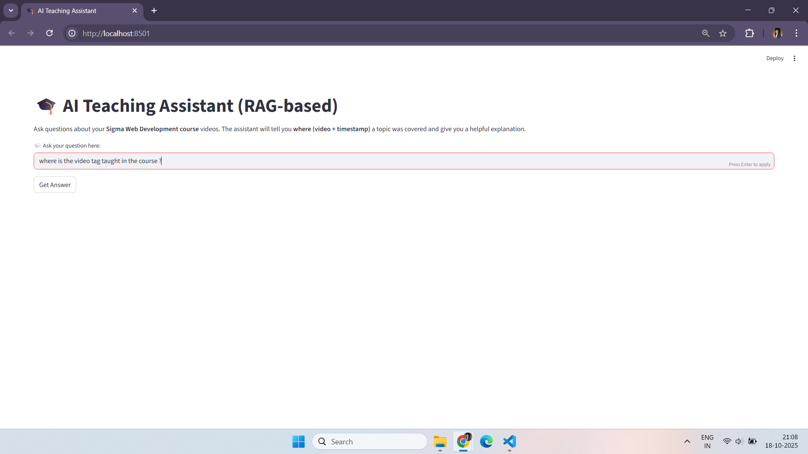
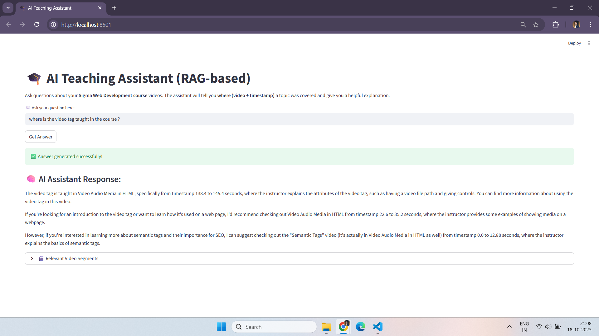
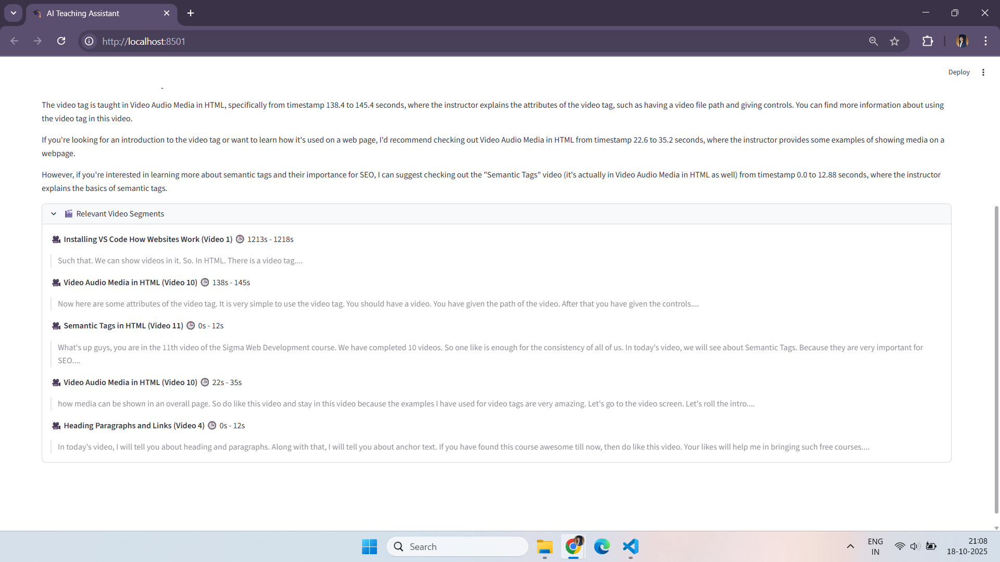

# 🎓 KnowWhere: RAG-Based AI Teaching Assistant

An intelligent Retrieval-Augmented Generation (RAG) AI that helps learners find **where specific topics are taught** within course videos — providing the **video title, timestamp, and human-like explanation** using LLaMA 3.2 and BGE-M3 embeddings.

---

## 🚀 How to Use This RAG AI Teaching Assistant on Your Own Data

### Step 0 – Install Dependencies

Before running anything, install all Python libraries required by the project:
```bash
pip install -r requirements.txt
```
This ensures Streamlit, pandas, numpy, scikit-learn, joblib, requests, Whisper, and other packages are installed.

Also Follow the **Required Installations** 

### **Step 1 – Collect Your Videos**
Move all your video files into the `videos` folder.

### **Step 2 – Convert Videos to MP3**
Convert all video files to audio format using:
```bash
python process_video.py
```

### **Step 3 – Convert MP3 to JSON (Transcription)**
Use Whisper to convert audio files to JSON transcripts:
```bash
python mp3_to_json.py
```

### **Step 4 – Merge JSON Chunks**
Combine subtitle chunks for efficiency:
```bash
python merge_chunks.py
```
This will create a `newjsons` folder containing merged JSON files.

### **Step 5 – Convert JSON Files to Vectors**
Convert transcripts to embeddings and save as a joblib file:
```bash
python preprocessing_json.py
```

### **Step 6 – Prompt Generation and LLM Response**
Load the saved joblib file, create a context-aware prompt, and generate AI responses using:
```bash
python process_incoming.py
```

### **Step 7 – Deploy the Model with Streamlit**
Launch the Streamlit-based GUI interface for interactive Q&A:
```bash
streamlit run KnowWhere.py
```

---

## 🖼️ Screenshots

### 🏠 **Home Page**
<p align="center">
  
</p>

### 💬 **Question Input and Response**
<p align="center">
  
</p>

### 🔍 **Embedding and Similarity Retrieval Process**
<p align="center">
  
</p>

---

## ⚙️ Required Installations

### **1. FFmpeg (Video to Audio Conversion)**
Download: [FFmpeg Builds](https://github.com/BtbN/FFmpeg-Builds/releases/download/latest/ffmpeg-master-latest-win64-gpl-shared.zip)

Extract to:
```
C:\Program Files\ffmpeg
```
Then add the `bin` folder path to environment variables:
```
C:\Program Files\ffmpeg\bin
```

### **2. Whisper (Speech-to-Text)**
```bash
pip install git+https://github.com/openai/whisper.git
```

### **3. Ollama (Local Model Hosting)**
Download and install Ollama: [https://ollama.com/download/OllamaSetup.exe](https://ollama.com/download/OllamaSetup.exe)

Pull the required models:
```bash
ollama pull bge-m3
ollama pull llama3.2
```

Run Ollama in background before executing the app.

---

## 🧠 Workflow Overview

| Stage             | Tool                | Purpose                       |
| ----------------- | ------------------- | ----------------------------- |
| Video → Audio     | FFmpeg              | Extract speech                |
| Audio → Text      | Whisper             | Transcribe                    |
| Text → Embeddings | BGE-M3 via Ollama   | Semantic representation       |
| Store             | Joblib              | Save embeddings and metadata  |
| Query → Embedding | BGE-M3              | User query vector             |
| Retrieve          | Cosine Similarity   | Find top relevant chunks      |
| Generate Answer   | LLaMA 3.2 via Ollama| Generate human-like response  |
| Output            | Text                | Answer with video + timestamp |

---

## 🧩 Project Features
- Converts educational videos into **searchable AI knowledge**  
- Retrieves **exact timestamps** and **video references**  
- Provides **natural, human-like explanations**  
- Detects and handles unrelated queries  
- **Interactive GUI** for seamless use  

---

## 👨‍💻 Author
**Abhijit Shinde**  

